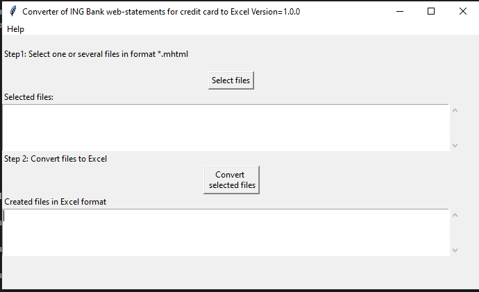
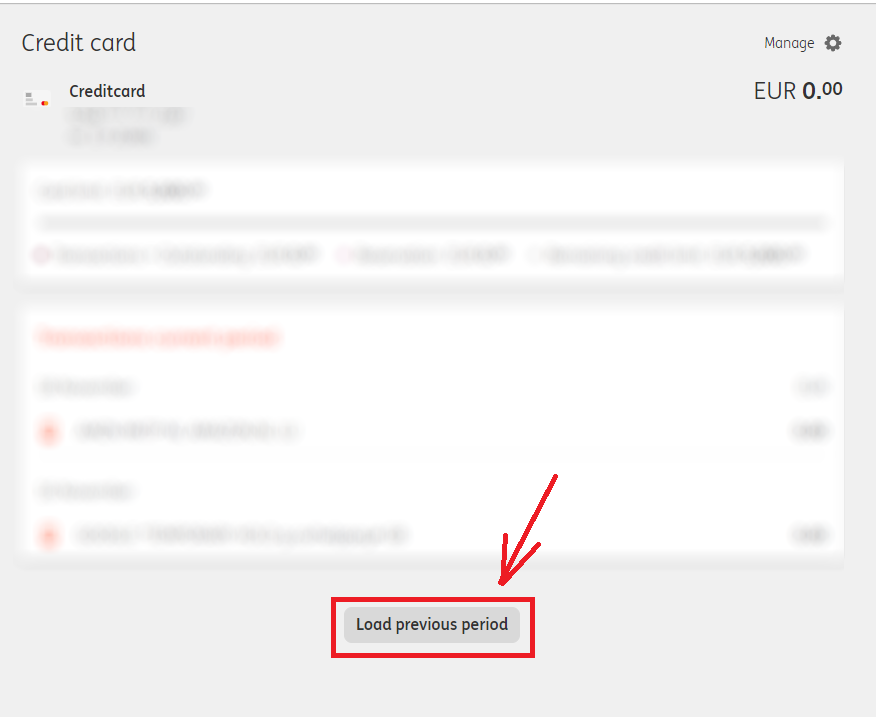
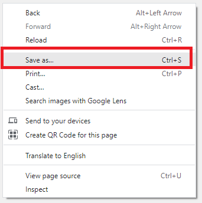
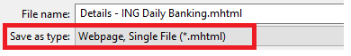

.. raw:: html
   <meta name="google-site-verification" content="wxRfmIrxtCMAk914PlUejPSaVnB2kT-dXQ5FvNLyMKs" />
   
<meta name="google-site-verification" content="wxRfmIrxtCMAk914PlUejPSaVnB2kT-dXQ5FvNLyMKs" />

==============
IngBank2Excel
==============

Simple tool to create an Excel extract with the credit card transactions of the
`ING Bank (Netherlands) <https://www.ing.nl>`_.

For whatever reason ING Bank `does not support
<https://www.ing.nl/particulier/betalen/creditcards/mijn-creditcard/meer-weten/creditcard-afschrift-lezen.html>`_
any downloadable statements on the credit card transactions. Not even in PDF
format, not to mention the CSV or Excel formats. This is despite the fact, that
the functionality if definitely needed and has been requested from the ING Bank
several times (e.g. see `facebook
<https://www.facebook.com/INGnl/posts/waar-kan-ik-mijn-afschriften-van-de-ing-creditcard-downloaden/604751509571414/>`_
and `klacht.nl
<https://www.klacht.nl/downloaden-transactie-op-spaarrekening-en-creditcard-uitgaven/>`_) 

The **IngBank2Excel**  (later in the text also referred to as **the tool**)
works around this limitation and allows to create an Excel
or CSV file with all credit card transactions, available through the web interface of the ING bank.



**Developer:** ev2geny at gmail.com

.. contents:: **Contents**


How to use
-----------

Installation
~~~~~~~~~~~~~

1. Download `the latest version of the tool <https://github.com/Ev2geny/IngBank2Excel/releases/latest>`_
2. Unzip the file in a separate directory and locate ``IngBank2ExcelGUI.bat``

Conversion
~~~~~~~~~~~

**Step 1** Create an .mhtml file from web page
```````````````````````````````````````````````
**Step 1.1** Login to the ING web with Google Chrome.

**Step 1.2** Navigate to the credit cards section.

**Result:**  The current period will be shown.

**Step 1.3** If needed, click on the **Load previous period** at the bottom.



**Result:**  The previous period will be loaded as well.

**Step 1.4** Repeat previous step to load as many prior periods as needed.

**Step 1.5** After all needed previous periods are loaded, right click anywhere on the web page and select **Save as..**.




**Step 1.6** Chose to save as a **Webpage, Single File (.mhtml)**.



**Step 1.7** Give the file a meaningful name and save it.

**Result:**  A file with the extension .mhtml will be created.

**Step 2** Convert .mhtml to Excel
```````````````````````````````````

**Step 2.1** Double click the ``IngBank2ExcelGUI.bat``

**Step 2.2** On the GUI interface press the **Select** button and select one or
several .mhtml files, created in the **Step 1**.

**Step 2.3** Press **Convert Selected Files**

**Result:**  .xlsx file(s) will be created

See also `Appendix A. Using the tool from the command line`_

FAQ
----
What Operating System can the tool work on? 
~~~~~~~~~~~~~~~~~~~~~~~~~~~~~~~~~~~~~~~~~~~~~~~~
* Windows starting from Windows 8.1 (does not work on Windows 7)

In theory the tool can also be used on the macOS and Linux, but at the moment
`regular releases <https://github.com/Ev2geny/IngBank2Excel/releases/latest>`_
do not contain executable file for these OSs. One can either create such
executables for these OSs or run the tool on these OSs directly from Python.


My antivirus program attacks the tool. What can I do?
~~~~~~~~~~~~~~~~~~~~~~~~~~~~~~~~~~~~~~~~~~~~~~~~~~~~~~
Antivirus programs attempt to detect viruses based on the algorithms, known
only to them. Very often an antivirus would block anything unknown and/or
suspicious. At the same time most of antivirus manufactures allow a
suspicious file to be sent to them for more detailed investigation, after
successful completion of which they would white list the suspicious file in
the next virus definitions update. As an example files for the Microsoft
Defender need to be sent `here
<https://www.microsoft.com/en-us/wdsi/filesubmission>`_, files for the Symantec `here
<https://symsubmit.symantec.com/>`_. The developer normally "agrees" the tool
with at least Microsoft Windows Defender.

So, if your antivirus does not like the **IngBank2Excel** there are 2 options:

* send the tool for investigation to the antivirus manufacturer

* inform the developer. The developer will need information about the antivirus you are using

Feedback
--------------

For issues reporting and/or enhancement requests is best to use the  `github issues functionality  <https://github.com/Ev2geny/IngBank2Excel/issues>`__

For general subjects start a discussion
`here <https://github.com/Ev2geny/IngBank2Excel/discussions>`__

In any case you can always email the developer: ev2geny at gmail.com

Appendix
----------

Appendix A. Using the tool from the command line
~~~~~~~~~~~~~~~~~~~~~~~~~~~~~~~~~~~~~~~~~~~~~~~~~
To use the tool from the command line one has to use `IngBank2Excel.py </core/IngBank2Excel.py>`__

::

   usage: IngBank2Excel.py [-h] [-o OUTPUT_EXCEL_FILE_NAME] [-f {ING_CREDIT}] [-t {xlsx,csv}] input_file_name

   Converting ING bank extracts to Excel

   positional arguments:
   input_file_name       Input file name for conversion

   options:
   -h, --help            show this help message and exit
   -o OUTPUT_EXCEL_FILE_NAME, --output OUTPUT_EXCEL_FILE_NAME
                           Output file name (without extension), which will be created in excel or CSV format
   -f {ING_CREDIT}, --format {ING_CREDIT}
                           Format of input file. If not provided, determined automatically
   -t {xlsx,csv}, --type {xlsx,csv}
                           Format of the output file to be created


At the moment `regular releases
<https://github.com/Ev2geny/IngBank2Excel/releases/latest>`_ do not contain
executable **IngBank2Excel** file for command line usage. One can either create such executable or run the tool directly from Python.
